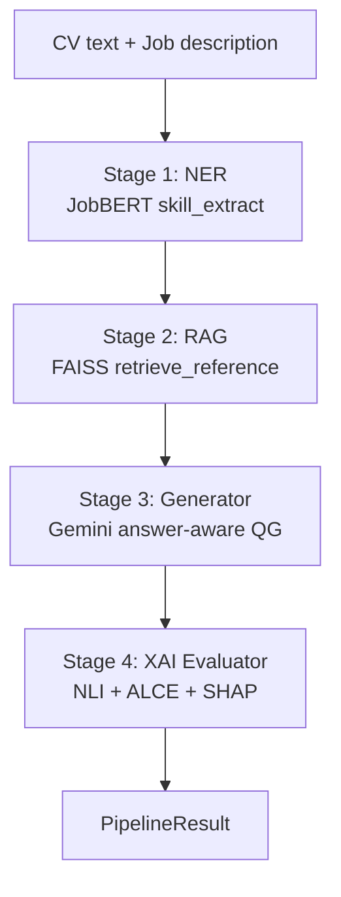
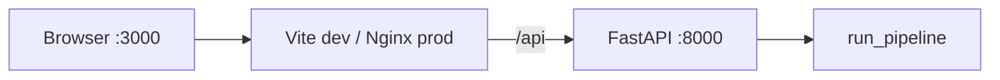
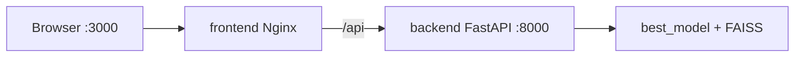

# SA-AQG — Implementation Detail

**SA-AQG** (Skill-Aware Answer-Aware Question Generation) generates personalized technical interview questions from a candidate CV and job description. The system extracts skills (NER), retrieves a reference answer (RAG), generates a question with Gemini (answer-aware QG), and optionally evaluates quality with XAI metrics (NLI, ALCE citations, SHAP).

---

## System Overview



| Stage | Owner | Input | Output |
|-------|-------|-------|--------|
| 1 — NER | Member A | CV text | `List[SkillEntity]` |
| 2 — RAG | Member D | CV + job description | Reference answer string |
| 3 — Generator | Member B | Skills + reference + job context | `GeneratorOutput` |
| 4 — XAI | Member C | `GeneratorOutput` | `EvaluatorOutput` |

**Entry points:**

- **CLI:** `python main.py <command>` from project root
- **HTTP API:** `uvicorn api.main:app` — FastAPI wrapper for the React UI
- **Stub mode:** `SA_AQG_USE_STUBS=true` swaps real ML modules for [`src/shared/stubs/module_stubs.py`](src/shared/stubs/module_stubs.py)

---

## Directory Map

```
project-NLP/
├── main.py                    # CLI entry point (argparse subcommands)
├── test.py                    # Stub-mode batch smoke test
├── requirements.txt           # Python dependencies
├── .env / .env.example        # API keys and runtime flags
├── docker-compose.yml         # Backend + frontend services
├── config/
│   ├── settings.yaml          # Pipeline, NER, RAG, generator, XAI hyperparameters
│   └── prompts.yaml           # Gemini prompt templates
├── api/                       # FastAPI HTTP layer (UI backend)
│   ├── main.py                # App factory, CORS, /api/health
│   ├── config.py              # Pydantic settings from .env
│   ├── schemas.py             # Request/response models (UI contract)
│   ├── routes/interview.py    # upload-cv, generate, specializations
│   ├── services/
│   │   ├── ingestion.py       # PDF/DOCX/TXT CV parsing
│   │   ├── memory.py          # In-memory CV session store
│   │   └── pipeline_adapter.py # Maps UI request → run_pipeline()
│   └── Dockerfile             # Backend container (build context: project root)
├── frontend/                  # React + Vite SPA (migrated from rag_system)
│   ├── src/App.tsx            # Main UI
│   ├── src/services/api.ts    # Axios client → /api
│   ├── nginx.conf             # Production /api proxy to backend:8000
│   └── Dockerfile             # Multi-stage Node build + Nginx
├── src/
│   ├── pipeline/
│   │   ├── runner.py          # End-to-end orchestration
│   │   └── batch_processor.py # Batch eval, BLEU/ROUGE, baselines
│   ├── core/
│   │   ├── NER/ner_module.py
│   │   ├── rag_retriever/rag_module.py
│   │   ├── question_generator/
│   │   │   ├── question_generator.py
│   │   │   ├── nli_evaluator.py
│   │   │   └── load_data.py
│   │   └── xai_evaluator/xai_module.py
│   ├── infrastructure/gemini/client.py
│   └── shared/
│       ├── contracts/schemas.py
│       ├── stubs/module_stubs.py
│       └── utils/io_utils.py
├── best_model/                # Fine-tuned JobBERT NER weights (Git LFS)
├── models/                    # FAISS index + metadata JSON
├── data/                      # Reference corpus, eval samples (gitignored)
├── outputs/                   # Pipeline JSONL results
└── docs/report/               # LaTeX technical report
```

---

## Module Reference

### Pipeline — [`src/pipeline/runner.py`](src/pipeline/runner.py)

| Function | Description |
|----------|-------------|
| `run_pipeline(cv_text, job_description, sample_id=None, run_shap=True, skip_evaluation=False)` | Run all 4 stages for one CV + job pair; returns `PipelineResult` |
| `run_pipeline_batch(samples, output_path=None, run_shap=True, skip_evaluation=False)` | Batch over list of `{cv_text, job_description}` dicts; streams to JSONL |

### NER — [`src/core/NER/ner_module.py`](src/core/NER/ner_module.py)

| Function | Description |
|----------|-------------|
| `skill_extract(text: str) -> List[Dict]` | Token-classification NER using `best_model/`; returns entities with `entity`, `type`, `start`, `end` |

### RAG — [`src/core/rag_retriever/rag_module.py`](src/core/rag_retriever/rag_module.py)

| Function | Description |
|----------|-------------|
| `build_faiss_index(corpus_path=None)` | Embed reference answers and write `models/faiss_index.faiss` |
| `retrieve_reference(cv_text, job_description, top_k=None)` | L2 search; returns best reference answer string |
| `retrieve_with_metadata(cv_text, job_description, top_k=3)` | Top-k retrieval with metadata and distances |
| `create_sample_corpus(output_path)` | Write 10-topic dev corpus to JSONL |

### Question Generator — [`src/core/question_generator/question_generator.py`](src/core/question_generator/question_generator.py)

| Function | Description |
|----------|-------------|
| `generate_question(skills, reference_answer, cv_text, job_context, sample_id)` | Gemini answer-aware QG; returns `GeneratorOutput` |
| `check_nli_entailment(reference_answer, generated_question)` | Single-pair NLI hallucination check |
| `generate_batch(samples, output_path)` | Batch generation to JSONL |
| `prepare_squad_for_qg()` | SQuAD v2 preprocessing helper |

### NLI Evaluator — [`src/core/question_generator/nli_evaluator.py`](src/core/question_generator/nli_evaluator.py)

| Function | Description |
|----------|-------------|
| `run_nli_evaluation(questions_path, n_samples)` | Batch NLI metrics on generated questions JSONL |
| `qualitative_nli_examples(...)` | Sample entailment/contradiction examples |

### XAI Evaluator — [`src/core/xai_evaluator/xai_module.py`](src/core/xai_evaluator/xai_module.py)

| Function | Description |
|----------|-------------|
| `evaluate_question(gen_output, run_shap=True)` | Full XAI eval for one question → `EvaluatorOutput` |
| `evaluate_batch(gen_outputs, run_shap, shap_sample_size)` | Batch XAI summary metrics |
| `compute_shap_attribution(...)` | SHAP attribution over CV vs answer segments |
| `compute_alce_scores(...)` | Citation precision/recall (ALCE-style) |

### Gemini Client — [`src/infrastructure/gemini/client.py`](src/infrastructure/gemini/client.py)

| Function | Description |
|----------|-------------|
| `get_gemini_client()` | Cached `google.genai` client from `GOOGLE_GEMINI_API_KEY` or `GEMINI_API_KEY` |
| `generate_with_retry(prompt, model_name, ...)` | Gemini call with exponential backoff on rate limits |

### Data Contracts — [`src/shared/contracts/schemas.py`](src/shared/contracts/schemas.py)

| Type | Fields |
|------|--------|
| `SkillEntity` | `entity`, `type` (SKILL/KNOWLEDGE), `start`, `end` |
| `GeneratorOutput` | `id`, `cv_text`, `skills`, `reference_answer`, `generated_question`, `job_context` |
| `EvaluatorOutput` | `id`, `nli_label`, `nli_score`, `citation_precision`, `citation_recall`, `shap_cv_ratio` |
| `PipelineResult` | All pipeline outputs combined for one sample |

### CLI — [`main.py`](main.py)

| Command | Action |
|---------|--------|
| `run` | Single pipeline run (`--cv`, `--job`, `--no-shap`) |
| `batch` | Full batch evaluation (`--input`, `--n`) |
| `create-data` | Generate sample eval JSONL |
| `build-index` | Build FAISS index (creates sample corpus if missing) |
| `eval-nli` | NLI evaluation on generated questions |
| `eval-xai` | SHAP + ALCE batch evaluation |
| `train-ner` | **Broken** — imports non-existent module (see Known Gaps) |

### HTTP API — [`api/`](api/)

| Endpoint | Handler |
|----------|---------|
| `GET /api/health` | Health + stub flag |
| `POST /api/interview/upload-cv` | Multipart CV upload → `cv_session_id` |
| `POST /api/interview/generate` | UI generate → `pipeline_adapter.generate_questions()` |
| `GET /api/interview/specializations` | List of specialization strings |

**Adapter mapping** ([`api/services/pipeline_adapter.py`](api/services/pipeline_adapter.py)):

- UI `custom.job_description` → pipeline `job_description` (or built from specialization/level/tech stack)
- UI `cv_session_id` → stored CV text
- `num_questions` (1–10) → repeated `run_pipeline(..., skip_evaluation=True)`
- `PipelineResult` → `GeneratedQuestion` (`question`, `ideal_answer`, `explanation`, `difficulty`, `category`)

---

## Configuration and Environment

### YAML — [`config/settings.yaml`](config/settings.yaml)

- `pipeline`: batch sizes, output paths
- `ner`: model paths, training hyperparameters
- `generator`: Gemini model, NLI model, temperature
- `xai`: SHAP model, sample sizes, CV contribution threshold
- `rag`: embedding model, FAISS index path, corpus path

### Prompts — [`config/prompts.yaml`](config/prompts.yaml)

- `answer_aware_question_generation`: Main QG prompt (skills + reference answer + job context)
- `generic_baseline_question`: Non-skill-aware baseline for BLEU/ROUGE comparison

### Environment variables

| Variable | Purpose |
|----------|---------|
| `GOOGLE_GEMINI_API_KEY` | Primary Gemini API key |
| `GEMINI_API_KEY` | Fallback alias (batch baseline generator) |
| `SA_AQG_USE_STUBS` | `"true"` → use stub modules (no GPU/API) |
| `CORS_ALLOW_ORIGINS` | JSON list for FastAPI CORS |

---

## Data Artifacts

| Path | Description |
|------|-------------|
| `best_model/` | Fine-tuned JobBERT NER (`model.safetensors` via Git LFS) |
| `models/faiss_index.faiss` | FAISS vector index (built by `build-index`) |
| `models/faiss_index_texts.json` | Reference texts + metadata for RAG |
| `data/reference_answers.jsonl` | RAG corpus (one JSON object per line) |
| `data/eval_samples.jsonl` | Batch evaluation input |
| `outputs/results.jsonl` | Pipeline batch output |

---

## UI Layer



- **Dev:** `npm run dev` in `frontend/` — Vite proxies `/api` → `localhost:8000`
- **Prod:** Nginx serves SPA; proxies `/api/` → `http://backend:8000/api/`
- **Key files:** `frontend/src/App.tsx`, `frontend/src/services/api.ts`, `frontend/src/components/QuestionList.tsx`

---

## Differences from `rag_system`

| Aspect | project-NLP (SA-AQG) | rag_system |
|--------|----------------------|------------|
| Retrieval | FAISS + sentence-transformers over JSONL corpus | Chroma + PDF question bank |
| NER | Fine-tuned JobBERT skill extraction | None |
| Generation | Always Gemini (answer-aware, skill-conditioned) | RAG from PDFs; optional Gemini |
| XAI | NLI + ALCE + SHAP in pipeline | LIME/SHAP explain endpoints (not in UI) |
| Output | One question per pipeline call | List from PDF retrieval + sampling |

---

## Known Gaps

1. **`train-ner` CLI broken** — imports `src.core.ner_extractor.ner_module.train_ner` which does not exist; real module is `src/core/NER/ner_module.py` with no `train_ner()`.
2. **`load_data.py` side-effect** — calls `save_data()` on import (downloads SQuAD v2).
3. **NER model LFS** — `best_model/model.safetensors` is a Git LFS pointer until `git lfs pull` is run.
4. **No `__init__.py` under `src/`** — imports rely on running from project root with `PYTHONPATH` including project root.
5. **Stub type mismatch** — `skill_extract()` returns `List[Dict]`; pipeline types expect `List[SkillEntity]` (works via duck typing).

---

## Runtime Topology (Docker)



See [README.md](README.md) for run instructions.
