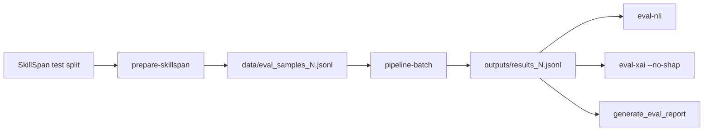

# Phase B — SkillSpan Evaluation Pipeline (Agent Handoff)

**Project:** `project-NLP` (SA-AQG)  
**Prerequisite:** Phase A demo works (`./scripts/run_demo.sh` or `main.py run` returns one question)  
**Branch:** `deploy/package` (or current main)  
**Do NOT commit:** `.env`, generated `data/eval_samples_*.jsonl`, `outputs/*`

---

## Goal

Build an automated evaluation workflow:

1. Download & filter **SkillSpan** test sentences (5 quick / 50 full)
2. Run SA-AQG pipeline on each → `outputs/results_N.jsonl`
3. Run **NLI** + **ALCE** (via `eval-xai`) on results
4. Generate markdown report `outputs/EVAL_REPORT_N.md`



---

## Known codebase gaps (must fix)

| Issue | Location | Fix |
|-------|----------|-----|
| No SkillSpan loader | missing | Create `src/eval/skillspan_loader.py` |
| `batch` does baseline+BLEU | `batch_processor.run_full_batch_evaluation` | Add separate `pipeline-batch` command |
| `eval-nli --input` required | `main.py` line 168 | Default `--input outputs/results.jsonl` |
| `eval-xai` expects `GeneratorOutput` | `main.py` cmd_eval_xai | Add converter from `PipelineResult` JSONL |
| No report generator | missing | Create `scripts/generate_eval_report.py` |

**PipelineResult JSONL fields:** `id`, `cv_text`, `job_description`, `skills`, `reference_answer`, `generated_question`, `evaluation`  
**GeneratorOutput needs:** `job_context` (map from `job_description`)

---

## Task 1 — `src/eval/skillspan_loader.py`

Create `src/eval/__init__.py` (empty).

### `load_skillspan_split(split="test")`

```python
from datasets import load_dataset
from src.shared.utils.io_utils import load_config

def load_skillspan_split(split: str = "test"):
    cfg = load_config()
    name = cfg["ner"]["dataset_name"]  # jensjorisdecorte/SkillSpan
    try:
        return load_dataset(name, split=split)
    except Exception:
        return load_dataset("jjzha/skillspan", split=split)
```

### Domain config (align with FAISS topics in `rag_module.create_sample_corpus`)

| domain | keywords | job_description |
|--------|----------|-----------------|
| kubernetes | kubernetes, k8s, container orchestration | Senior DevOps Engineer — Kubernetes and cloud infrastructure |
| docker | docker, containerization, container | DevOps Engineer — Docker and container platforms |
| cicd | ci/cd, jenkins, github actions, pipeline | Platform Engineer — CI/CD and release automation |
| microservices | microservice, microservices, api gateway | Backend Engineer — microservices architecture |
| python | python, django, flask, fastapi | Python Backend Engineer |
| machine_learning | pytorch, tensorflow, machine learning, ml, model | Machine Learning Engineer |
| sql | sql, postgres, postgresql, database, mysql | Data Engineer — SQL and data platforms |
| api_design | rest, api, graphql, http | Backend Engineer — API design |
| distributed_systems | distributed, kafka, cap theorem, consensus | Distributed Systems Engineer |
| testing | test, tdd, qa, unit test, pytest | QA / Test Engineer |

### Filter logic

For each row in dataset:

1. `sentence = " ".join(item["tokens"])`
2. Skip if no skill annotation: any tag in `item["tags_skill"]` starts with `B` (BIO format may be `B`/`I` without hyphen)
3. Prefer `item.get("source") == "tech"` when picking domains
4. Match first domain whose keyword appears in `sentence.lower()`
5. Pick **one sentence per domain** until `n` samples collected
6. If `n=50` and fewer than 10 domains, allow multiple sentences per domain (round-robin)

### Output record

```json
{
  "id": "skillspan_kubernetes_001",
  "cv_text": "<sentence text>",
  "job_description": "<from table>",
  "domain": "kubernetes",
  "source": "skillspan"
}
```

### Public function

```python
def export_skillspan_eval(output_path: str, n: int = 5, split: str = "test") -> int:
    """Write JSONL, return count written."""
```

---

## Task 2 — CLI commands in `main.py`

### `prepare-skillspan`

```python
def cmd_prepare_skillspan(args):
    from src.eval.skillspan_loader import export_skillspan_eval
    count = export_skillspan_eval(args.output, n=args.n, split=args.split)
    print(f"Wrote {count} samples to {args.output}")
```

Args:
- `--n` default 5
- `--output` default `data/eval_samples_{n}.jsonl` (compute from n)
- `--split` default `test`

### `pipeline-batch`

```python
def cmd_pipeline_batch(args):
    from src.pipeline.runner import run_pipeline_batch
    from src.shared.utils.io_utils import load_jsonl
    samples = load_jsonl(args.input)[: args.n]
    run_pipeline_batch(
        samples=samples,
        output_path=args.output,
        run_shap=args.shap,
        skip_evaluation=args.skip_evaluation,
    )
```

Args:
- `--input` default `data/eval_samples_5.jsonl`
- `--output` default `outputs/results.jsonl`
- `--n` optional limit
- `--shap` flag (default False)
- `--skip-evaluation` default **True** (eval in separate step)

### Converter helper (add to `main.py` or `src/eval/converters.py`)

```python
def pipeline_record_to_generator_output(record: dict) -> GeneratorOutput:
    skills = [SkillEntity.from_dict(s) for s in record.get("skills", [])]
    return GeneratorOutput(
        id=record["id"],
        cv_text=record["cv_text"],
        skills=skills,
        reference_answer=record["reference_answer"],
        generated_question=record["generated_question"],
        job_context=record.get("job_description", record.get("job_context", "")),
    )
```

### Fix `eval-nli`

- Change `--input` to default `outputs/results.jsonl`, not required
- Pass `args.n` through

### Fix `eval-xai`

- Default `--input outputs/results.jsonl`
- Use converter instead of `GeneratorOutput.from_dict(r)` directly

---

## Task 3 — Shell orchestrators

Create with **LF line endings** (run `sed -i 's/\r$//' scripts/*.sh` on Linux).

### `scripts/run_eval_quick.sh`

```bash
#!/usr/bin/env bash
set -euo pipefail
cd "$(dirname "$0")/.."
export SA_AQG_USE_STUBS="${SA_AQG_USE_STUBS:-false}"

python main.py prepare-skillspan --n 5 --output data/eval_samples_5.jsonl
python main.py pipeline-batch \
  --input data/eval_samples_5.jsonl \
  --output outputs/results_5.jsonl \
  --skip-evaluation
python main.py eval-nli --input outputs/results_5.jsonl --n 5
python main.py eval-xai --input outputs/results_5.jsonl --n 5 --no-shap
python scripts/generate_eval_report.py \
  --results outputs/results_5.jsonl \
  --nli outputs/nli_evaluation.jsonl \
  --xai outputs/evaluation_results.jsonl \
  --output outputs/EVAL_REPORT_5.md
echo "Done: outputs/EVAL_REPORT_5.md"
```

### `scripts/run_eval_full.sh`

Same with `--n 50`, paths `*_50.jsonl`, `EVAL_REPORT_50.md`.

---

## Task 4 — `scripts/generate_eval_report.py`

### Inputs

- `--results` pipeline JSONL
- `--nli` from `eval-nli` → `outputs/nli_evaluation.jsonl`
- `--xai` from `eval-xai` → `outputs/evaluation_results.jsonl`
- `--output` markdown path
- `--template` default `docs/templates/EVAL_REPORT_TEMPLATE.md`

### Logic

1. Merge by `id`: domain from results, ALCE from xai, NLI from nli (or xai if nli missing)
2. Compute averages: `avg_citation_precision`, `avg_citation_recall`, `entailment_rate`
3. Optional baseline row: for each result call `generate_generic_baseline(ref, job)` from `batch_processor`, run NLI only, ALCE=0
4. Fill template placeholders
5. Pick best entailment sample for **Pipeline Walkthrough** section

### Output table columns

| Sample | Primary Domain | ALCE Precision | ALCE Recall | NLI Status |

---

## Task 5 — `docs/templates/EVAL_REPORT_TEMPLATE.md`

Use this structure (placeholders in `{{double_braces}}`):

```markdown
# SA-AQG System Evaluation Report (ALCE & NLI Grounding)

## 1. Evaluation Setup
* **Source Dataset:** Filtered technical subset from SkillSpan test split
* **Sample Count:** {{sample_count}}
* **Reference Answer Corpus:** 10-entry localized FAISS index
* **Generator Core:** Gemini-2.5-flash
* **Metrics:** ALCE Citation Precision/Recall, NLI Entailment Rate

## 2. Quantitative Results
{{results_table}}

## 3. Core Metric Analysis
### ALCE Citation Precision & Recall
* **Precision:** {{precision_analysis}}
* **Recall:** {{recall_analysis}}

### NLI Answer-Awareness Gate
* **Factual Grounding:** {{nli_analysis}}

## 4. Pipeline Walkthrough Stream
* **Input Text Profile:** {{walkthrough_cv}}
* **Stage 1 Skills:** {{walkthrough_skills}}
* **Stage 2 Reference Answer:** {{walkthrough_reference}}
* **Stage 3 Generated Question:** {{walkthrough_question}}
```

---

## Task 6 — README update

Add section **"Phase B — Evaluation"** after Phase A demo:

| Run | Command | Time estimate |
|-----|---------|---------------|
| Quick (5) | `chmod +x scripts/run_eval_quick.sh && ./scripts/run_eval_quick.sh` | ~5–15 min (Gemini calls) |
| Full (50) | `./scripts/run_eval_full.sh` | ~30–60 min |

---

## Task 7 — `.gitignore` updates

Ensure these stay ignored (already partially done):

```
data/eval_samples_*.jsonl
outputs/
.env
```

Allow if needed: `!docs/templates/EVAL_REPORT_TEMPLATE.md`

---

## Remote server runbook (after implementation)

```bash
git clone https://github.com/Phuongglead/project-NLP.git
cd project-NLP
git checkout deploy/package   # or your branch
git lfs install && git lfs pull
cp .env.example .env          # GOOGLE_GEMINI_API_KEY=...
conda activate sa-aqg
pip install -r requirements.txt datasets faiss-cpu email-validator
python main.py build-index
export SA_AQG_USE_STUBS=false

# Quick eval (5 samples)
chmod +x scripts/run_eval_quick.sh
./scripts/run_eval_quick.sh

# Full eval (50 samples)
./scripts/run_eval_full.sh

# View report
cat outputs/EVAL_REPORT_5.md
```

---

## Acceptance criteria

- [ ] `python main.py prepare-skillspan --n 5` writes 5 JSONL records with domains
- [ ] `python main.py pipeline-batch --input data/eval_samples_5.jsonl --output outputs/results_5.jsonl` completes
- [ ] `eval-nli` and `eval-xai` run without `--input` when file exists at default path
- [ ] `eval-xai` accepts pipeline JSONL (not only GeneratorOutput)
- [ ] `outputs/EVAL_REPORT_5.md` generated with filled metrics table
- [ ] `./scripts/run_eval_quick.sh` runs end-to-end

---

## Agent prompt (copy-paste to remote Cursor)

```
Implement Phase B from project-NLP/PHASE_B.md:

1. Create src/eval/skillspan_loader.py + src/eval/__init__.py
2. Add main.py commands: prepare-skillspan, pipeline-batch
3. Fix eval-nli/eval-xai defaults + PipelineResult→GeneratorOutput converter
4. Create scripts/run_eval_quick.sh, run_eval_full.sh, generate_eval_report.py
5. Create docs/templates/EVAL_REPORT_TEMPLATE.md
6. Update README Phase B section
7. Test: ./scripts/run_eval_quick.sh with SA_AQG_USE_STUBS=true first, then false if API key available

Match existing code style. Use LF line endings for shell scripts.
Do not commit .env or outputs/.
```

---

## Out of scope

- Docker
- Fixing `train-ner` CLI
- UI changes
- Phase A files (`sample_cv.txt`, `run_demo.sh`) if not yet created — optional same PR
